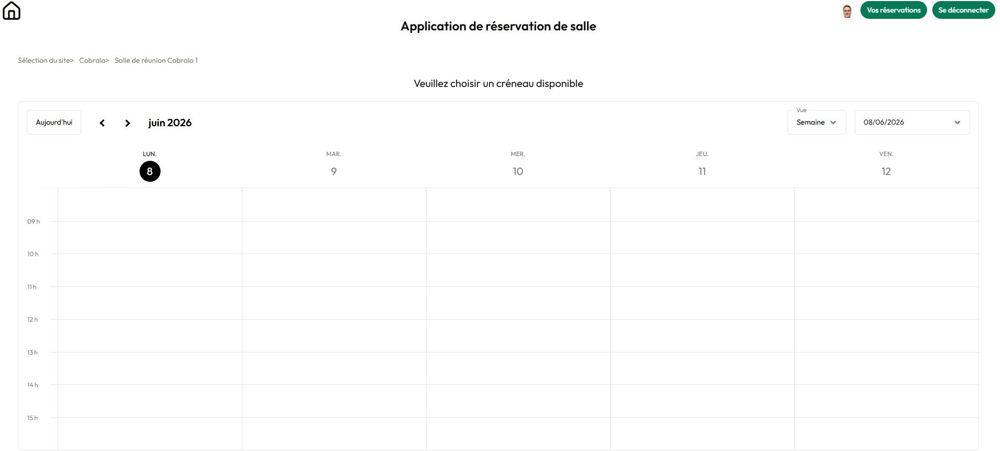

# Room Reservation

Application de réservation de salles de réunion multi-sites. Permet aux collaborateurs de consulter la disponibilité des salles, de créer, modifier et supprimer des réservations via un calendrier interactif.



## Fonctionnalités

- Authentification Google OAuth via Auth.js
- Navigation par site et par salle
- Calendrier interactif avec vues jour, semaine et mois (schedule-x)
- Création de réservation par double-clic sur un créneau
- Modification et suppression de réservation (auteur uniquement)
- Validation des données en temps réel (chevauchements, horaires, durée minimum)
- Page récapitulative des réservations par utilisateur avec filtrage par site et salle
- Messages d'erreur spécifiques via toast
- Interface responsive (desktop et mobile)

## Stack technique

- **Framework** : Next.js 16 (App Router)
- **Langage** : TypeScript (strict)
- **Base de données** : PostgreSQL (Neon)
- **ORM** : Prisma 7
- **Authentification** : Auth.js v5 (Google OAuth)
- **UI** : shadcn/ui, Tailwind CSS
- **Calendrier** : schedule-x (thème shadcn)
- **Validation** : Zod (client et serveur)
- **Tests** : Vitest

## Installation

```bash
git clone https://github.com/JulienLed/room-reservation.git
cd room-reservation
npm install
```

## Configuration

Créer un fichier `.env` à la racine du projet :

```env
DATABASE_URL="votre-url-neon"
AUTH_SECRET="votre-secret"
AUTH_GOOGLE_ID="votre-google-client-id"
AUTH_GOOGLE_SECRET="votre-google-client-secret"
```

## Lancement

```bash
npx prisma db push
npx prisma db seed
npm run dev
```

L'application est accessible sur `http://localhost:3000`.

## Tests

```bash
npx vitest
```

## Structure du projet

```
app/
  (main)/           # Pages protégées par l'authentification
    home/            # Page d'accueil avec sélection de site
      site/[siteId]/ # Sélection de salle
        room/[roomId]/ # Calendrier et réservation
    reservations/    # Récapitulatif des réservations utilisateur
  (signIn)/          # Page de connexion
actions/             # Server actions (CRUD réservations)
components/          # Composants réutilisables (header, breadcrumb, UI)
lib/                 # Logique métier, utilitaires, configuration Prisma
prisma/              # Schéma et seed
```

## Auteur

Julien Ledent — [Le Poteau du Web](https://www.lepoteauduweb.be)